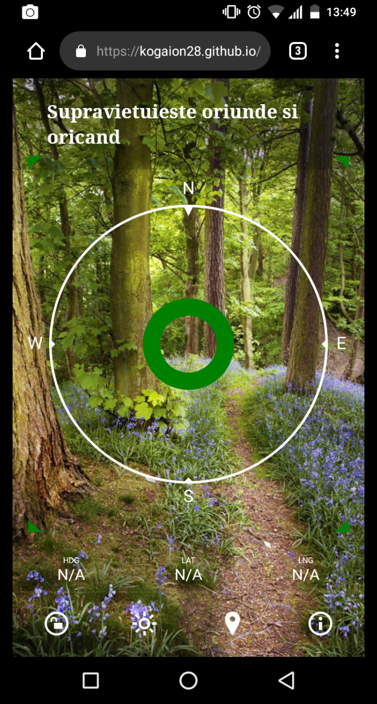

# kogaion28.github.io
Aplicatie de supravietuire.

Foloseste senzorul GPS pentru localizarea telefonului.

Contine carti de ajutor.

Contine o harta cu locatia exacta a telefonului.

Survival application.

Use the GPS sensor to locate the phone.
Contains help books.
It contains a map with the exact location of the phone.

